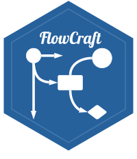

# FlowCraft 

A free, local, browser-based diagramming application. No server, no signup, no external dependencies---just open `index.html` in your browser and start diagramming.

If you find FlowCraft useful, consider buying me a coffee: [buymeacoffee.com/sysilviakim](https://buymeacoffee.com/sysilviakim)

## Features

- **Multiple diagram types**: Flowcharts, UML, network diagrams, org charts, mind maps, ER diagrams, timelines, and more
- **Smart connectors**: Orthogonal, straight, and curved routing with automatic re-routing when shapes move; editable labels and draggable waypoints
- **Drag-and-drop**: Drag shapes from the palette onto the canvas, or click-drag to draw; Alt+drag to clone
- **Rich text editing**: Double-click any shape to edit inline with bold, italic, underline, font family, size, color, and alignment
- **Color customization**: Color picker, direct hex code entry, preset swatch palette, and 50% transparency toggle
- **Properties panel**: Context-sensitive styling for shapes, connectors, and multi-selections
- **Layers**: Organize diagrams with multiple layers, each with visibility and lock controls
- **Undo/Redo**: Full command-based history (Ctrl+Z / Ctrl+Y)
- **Snap & align**: Grid snapping, shape-to-shape alignment guides, distance indicators, and alignment/distribution tools
- **Containers & swim lanes**: Group shapes inside containers with configurable lanes and colors
- **Timelines**: Block and line timelines with date ranges, intervals, milestones with optional labels, configurable date formats, and auto-calculated dates
- **Export**: PNG, JPG, PDF, and SVG export
- **Auto-save**: Diagrams are automatically saved to localStorage
- **Customizable palette**: Drag to reorder shape categories; recently used shapes shown at top

## Getting Started

1. Clone or download this repository
2. Open `index.html` in any modern browser
3. Start diagramming

No build step, no dependencies, no internet connection required.

## Keyboard Shortcuts

| Shortcut | Action | Shortcut | Action |
|---|---|---|---|
| Ctrl+Z | Undo | Ctrl+B | Bold |
| Ctrl+Y | Redo | Ctrl+I | Italic |
| Ctrl+C | Copy | Ctrl+U | Underline |
| Ctrl+V | Paste | Delete | Delete selected |
| Ctrl+A | Select all | Arrow keys | Move selected |
| Ctrl+S | Save | Ctrl+Arrow | Nudge by 1px |
| Space+Drag | Pan canvas | Scroll wheel | Pan canvas |
| Ctrl+Scroll | Zoom | Alt+Drag | Clone shape |
| Double-click | Edit shape text | | |

## Shape Categories

- **Basic**: Rectangle, Circle, Triangle, Diamond, and more
- **Flowchart**: Process, Decision, Terminal, I/O, Document, Database, and more
- **UML**: Class, Interface, Package, Actor, Use Case, Component, Lifeline
- **Network**: Server, Desktop, Laptop, Cloud, Router, Switch, Firewall
- **Org Chart**: Person card with name/title
- **ER Diagram**: Entity, Relationship, Attribute
- **Mind Map**: Central Topic, Sub-topic, Idea
- **Containers**: Swim lane containers with configurable lanes and colors
- **Timeline**: Block and line timelines, interval bars, and milestone markers

## File Format

Diagrams are saved as `.flowcraft.json` files; plain JSON that's easy to inspect, version-control, or process with scripts.

## License

Copyright (C) 2026 Seo-young Silvia Kim

This program is free software: you can redistribute it and/or modify it under the terms of the GNU Affero General Public License as published by the Free Software Foundation, either version 3 of the License, or (at your option) any later version.

See [LICENSE](https://www.gnu.org/licenses/agpl-3.0.html) for details.

